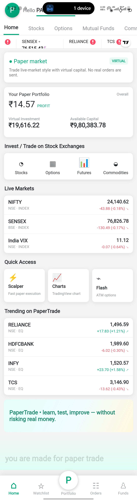
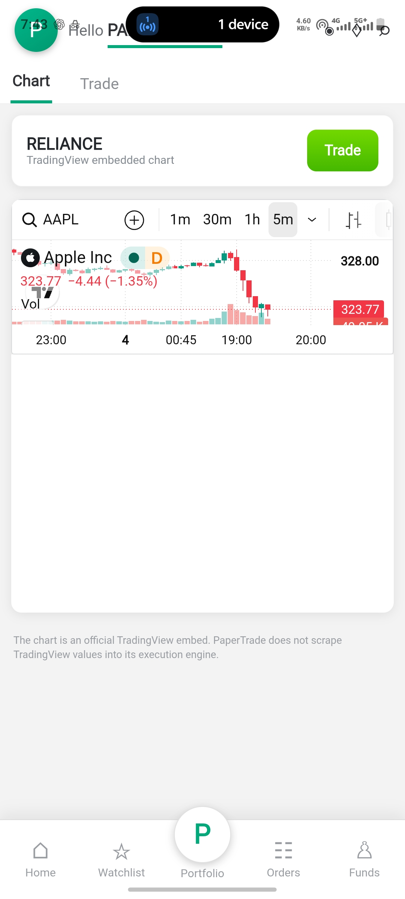
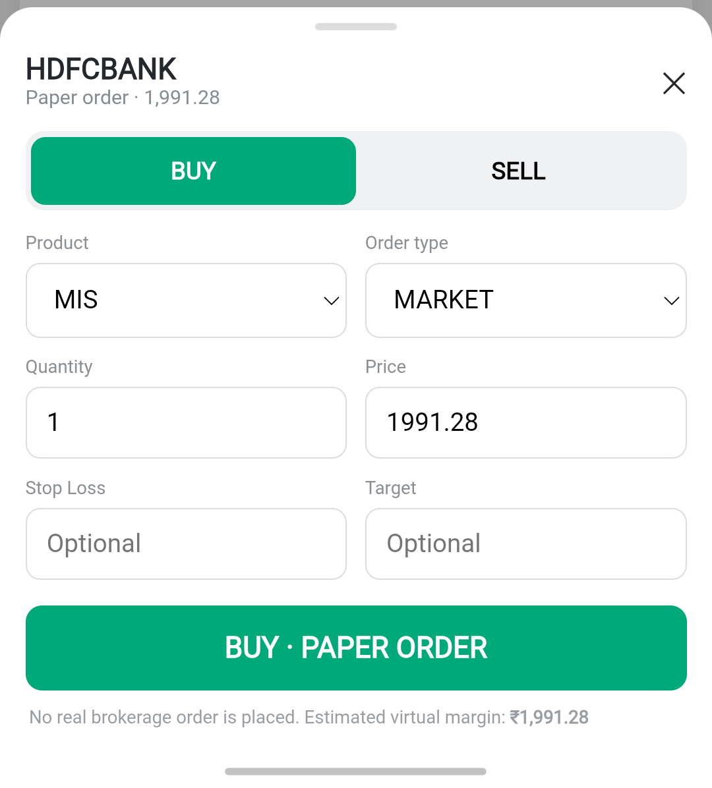
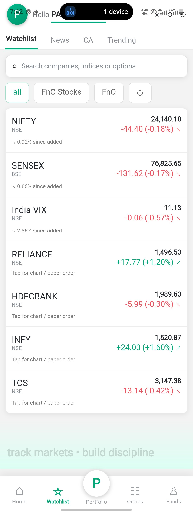
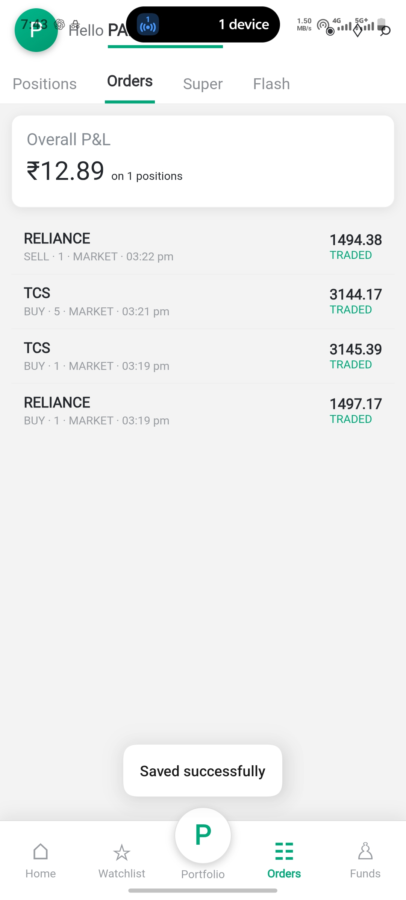
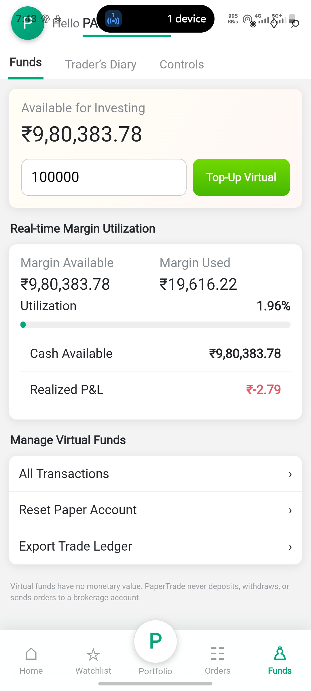

# PaperTrade

**PaperTrade – NIFTY Paper Trading & Trade Journal**

PaperTrade is an open-source paper trading application designed to help users learn NIFTY options trading without risking real money.

The project provides a simulated trading environment where users can practice trades, monitor virtual profit and loss, maintain a trading diary, and analyze their trading decisions.

## Features

- NIFTY paper trading
- Options trading simulation
- NIFTY option chain interface
- Virtual trading balance
- Buy and Sell simulation
- Open positions tracking
- Profit and Loss monitoring
- Trading diary
- Trade history
- Risk-management learning
- TradingView chart integration
- Educational trading environment

## Purpose

The purpose of PaperTrade is to provide a safe environment for students, beginners, and traders to practice trading strategies before using real money.

Users can record their trades and review their decisions to understand:

- What went right
- What went wrong
- Trading mistakes
- Risk-management mistakes
- Trading performance
- Areas for improvement

## Future Development

Planned features include:

- Real-time market-data provider integration
- Advanced NIFTY option chain
- Trade analytics dashboard
- Risk/reward analysis
- Trading statistics
- Strategy performance analysis
- AI-assisted trade journal analysis
- Automatic identification of trading mistakes
- Personalized trading insights
- Improved charts and market visualization

## Technology

The project is being developed as an Android application.

Additional technologies and APIs may be integrated as the project develops.

## Installation

The project is currently under active development.

Detailed installation instructions and APK releases will be added as development progresses.

## Open Source

PaperTrade is an open-source project.

Developers are welcome to contribute improvements, report bugs, suggest features, and help improve the project.

## Contributing

Contributions are welcome.

You can contribute by:

- Reporting bugs
- Suggesting new features
- Improving documentation
- Improving the user interface
- Adding tests
- Fixing issues
- Improving trading analytics

## Roadmap

### Version 0.1
- Basic paper trading
- Virtual balance
- Buy/Sell simulation
- Positions
- Trade diary

### Version 0.2
- Improved option chain
- Trade statistics
- Risk-management tools
- Performance dashboard

### Version 0.3
- AI-assisted trade analysis
- Trading mistake detection
- Personalized trading insights

## Disclaimer

PaperTrade is intended for educational and paper-trading purposes only.

It does not provide financial or investment advice. Market information displayed by the application should not be considered a recommendation to buy or sell any financial instrument.

Real-time exchange-grade market data may require integration with an authorized market-data provider.

## License

This project is licensed under the MIT License.

See the [LICENSE](LICENSE) file for details.

## Maintainer

Maintained by **Naresh**

GitHub: [@nareshignou282-ui](https://github.com/nareshignou282-ui)

---
## Screenshots

### Dashboard

### Charts

### Buy / Sell

### Watchlist

### Orders

### Balance

If you find PaperTrade useful, consider giving the repository a ⭐ and contributing to the project.
